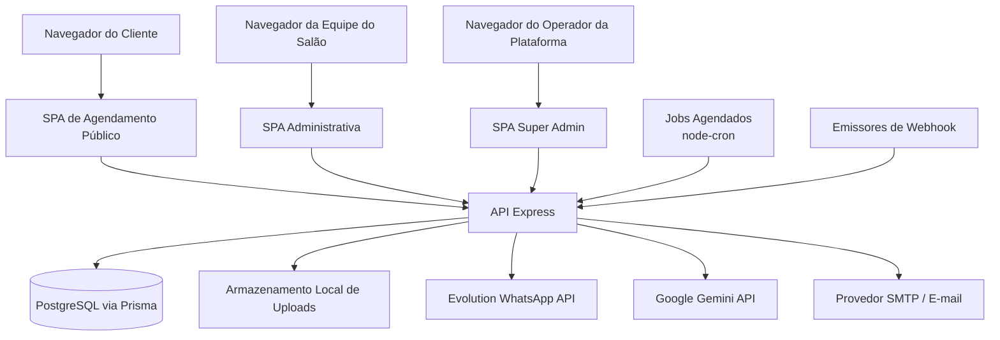
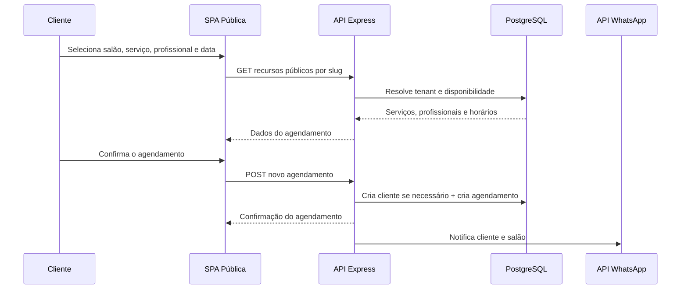
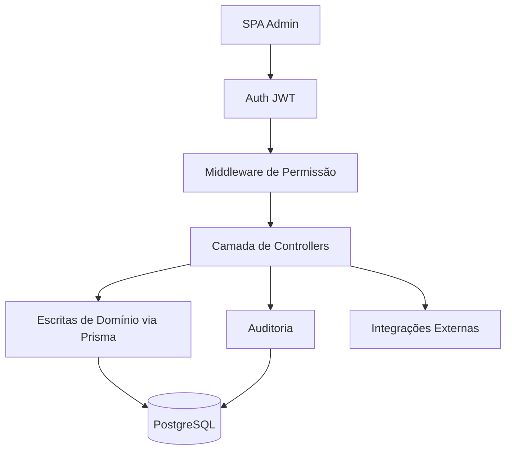
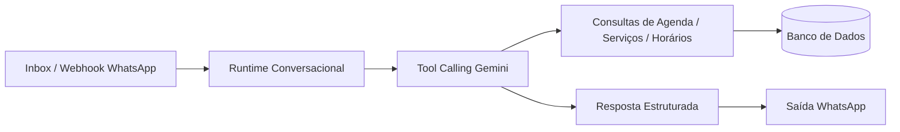
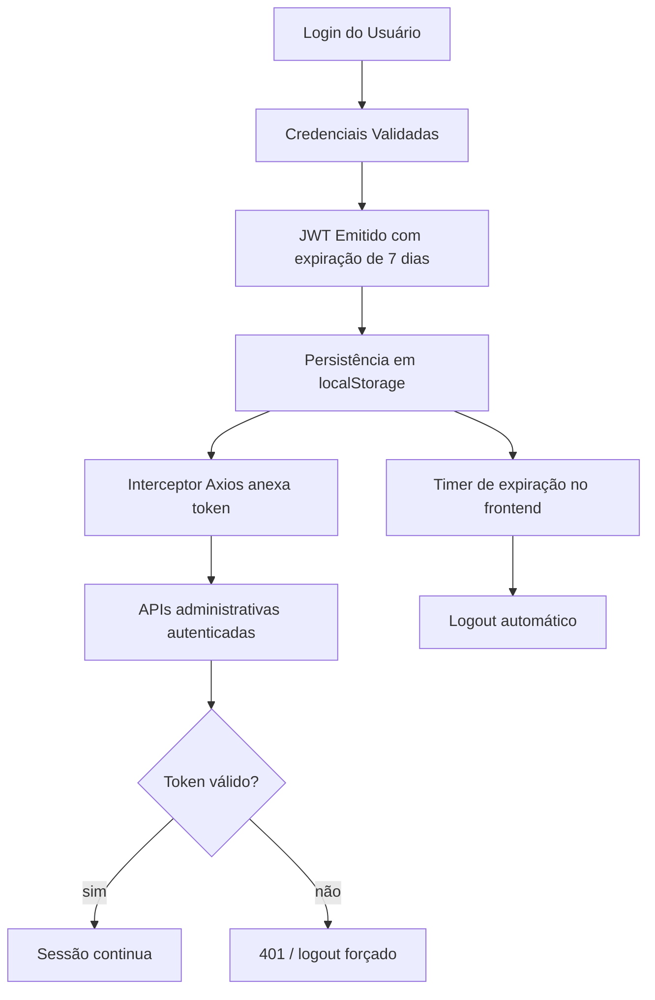
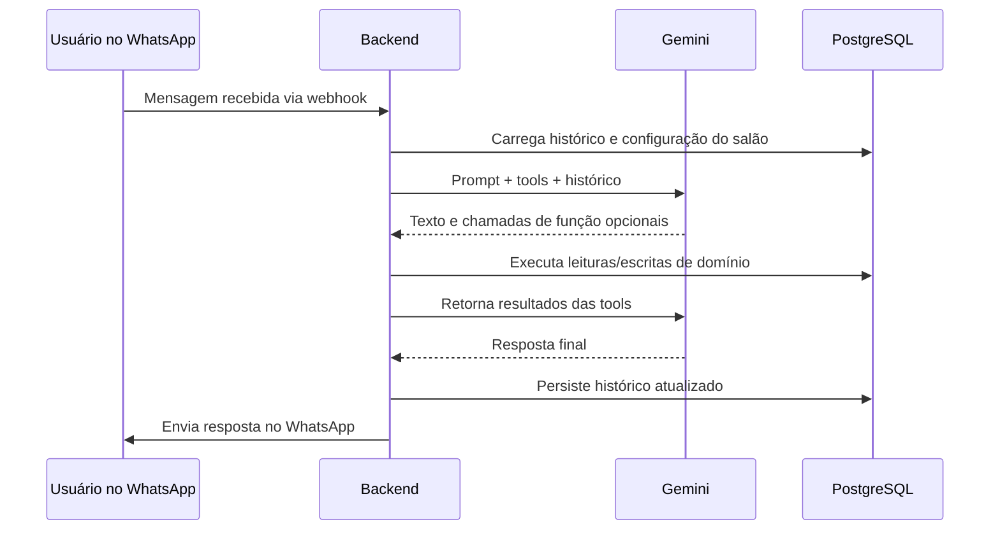

# Arquitetura

## Visão Executiva

Este repositório implementa uma plataforma SaaS multi-tenant para operação de salões, com três superfícies principais:

- uma experiência pública de agendamento para clientes finais
- um painel autenticado de operação para equipe e gestão do salão
- um pequeno plano de controle para super admin da plataforma

O sistema é estruturado como uma aplicação web:

- `frontend/`: SPA em React + Vite
- `backend/`: aplicação Node.js + Express expondo APIs públicas, admin, webhook, auth e super-admin
- `database`: PostgreSQL acessado via Prisma

O produto também já inclui integrações operacionais relevantes:

- mensageria WhatsApp via Evolution API
- suporte conversacional e assistido por IA via Google Gemini
- lembretes agendados via `node-cron`
- recuperação de senha por e-mail/SMTP

Este não é um repositório de runtime genérico de agentes. Quando esta documentação usa termos como `runtime`, `capabilities` ou `connectors`, eles se referem à arquitetura real presente no código: runtime web, fronteiras de permissão/capacidade e superfícies de integração com terceiros.

## Arquitetura de Alto Nível

## Componentes Centrais

### Frontend

O frontend é uma SPA React com carregamento lazy e grupos de rota para:

- `LandingPage`
- agendamento público em `/:slug`
- painel administrativo em `/admin`
- plano de controle super-admin em `/superadmin`

Responsabilidades operacionais:

- persistência de sessão no navegador
- navegação orientada por permissões
- interface de agenda, checkout, financeiro, estoque, CRM e relatórios
- orquestração do funil público por `slug` do salão

### Backend

O backend Express é o limite principal da aplicação para:

- autenticação e recuperação de senha
- descoberta pública do salão e criação de agendamentos
- APIs autenticadas de operação do salão
- APIs de super-admin
- upload de arquivos
- webhooks e notificações WhatsApp
- lembretes agendados e gatilhos de automação com IA

### Banco de Dados

Os modelos Prisma mostram um domínio fortemente centrado em `Salao`:

- `Salao` como raiz do tenant
- `Usuario` para acessos autenticados
- `Profissional`, `Cliente`, `Servico`, `Produto`, `Pacote`
- `Agendamento` e entidades relacionadas de checkout/pagamento/itens
- `CaixaSessao` e `CaixaMovimento` para fechamento por turno
- `AuditLog` e `PasswordResetToken` para governança e segurança
- `Conversa` e `Mensagem` para inbox e atendimento assistido por IA

## Responsabilidades de Runtime

### Runtime do Navegador

- renderizar rotas SPA e preservar estado local de sessão
- resolver jornadas por `slug` do salão
- enviar chamadas autenticadas com JWT
- aplicar restrições de UX por permissão

### Runtime da API

- autenticar JWTs e resolver contexto do tenant
- aplicar middleware de permissões e ações
- executar operações de agenda, caixa, CRM, estoque e relatórios
- persistir auditoria em fluxos sensíveis
- coordenar integrações com WhatsApp, e-mail e Gemini

### Runtime em Background

- executar disparo de lembretes via `node-cron`
- disparar campanhas e rotinas proativas acionadas pelo painel
- persistir histórico conversacional para continuidade das interações

## Responsabilidades Locais vs Nuvem

### Responsabilidades Locais/Da Aplicação

- regras de negócio e isolamento por tenant
- ciclo de vida do agendamento e detecção de colisão
- lógica de caixa, comissão e estoque
- emissão de JWT e ciclo de recuperação de senha
- hospedagem local de arquivos enviados

### Responsabilidades Externas/Nuvem

- transporte WhatsApp via Evolution API
- inferência LLM e tool calling via Gemini
- entrega de e-mail por SMTP
- hospedagem do banco, caso seja externa ao host da aplicação

## Fluxo de Dados

### Agendamento Público

### Operação Administrativa

## Modelo Operacional

O sistema segue um modelo clássico de control plane web:

- fluxos públicos são endereçados por `slug`
- fluxos privados são autenticados por JWT
- escritas críticas são centralizadas no backend
- isolamento de tenant é conduzido primariamente por `salaoId`
- acesso fino é controlado por `permissions` e `actionPermissions`
- parte das automações é síncrona, parte é agendada ou acionada por integração

## Topologia de Conectores e Comunicação

## Ciclo de Vida da Sessão

## Comunicação Nuvem-IA

Este repositório não implementa uma camada genérica de orquestração de agentes em nuvem. O equivalente mais próximo é o assistente Gemini por salão usado nos fluxos de mensageria.

## Evolução Futura

A arquitetura atual pode evoluir em direções claras:

- mover lembretes e campanhas para um worker dedicado
- substituir uploads locais por object storage
- externalizar auditoria, eventos e telemetria operacional
- adicionar execução com filas para campanhas, lembretes e fluxos de IA
- formalizar contratos de integração para WhatsApp, e-mail e futuros canais
- introduzir observabilidade e rate limiting por tenant
- adicionar abstração de modelos/provedores se o uso de IA crescer
