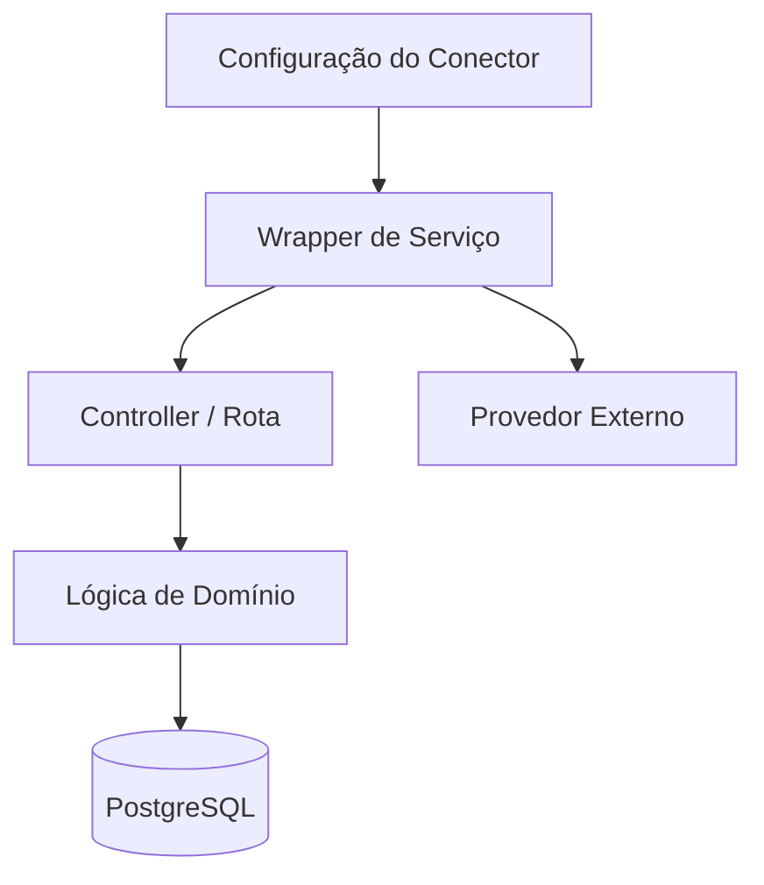

# Connectors

## Visão Geral

O repositório não expõe hoje um SDK formal de conectores, mas já possui uma camada prática de integração composta por serviços, controllers e rotas. No estado atual, um conector pode ser entendido como qualquer fronteira que troca dados com um sistema externo ou com uma superfície operacional distinta da plataforma.

Classes de conectores hoje presentes:

- conector web público via APIs de agendamento
- conector de painel admin via APIs autenticadas
- conector de transporte WhatsApp via Evolution API
- conector de IA via Google Gemini
- conector de e-mail para recuperação de senha
- conector de webhook para ingestão de eventos externos

## Modelo de Abstração

O padrão implícito no código segue esta estrutura:

1. configuração por tenant armazenada em `Salao`
2. wrapper de serviço em `backend/src/services`
3. camada de controller ou rota
4. leituras e escritas de domínio via Prisma
5. eventual exposição de estado/configuração no painel administrativo



## Conectores Baseados em Navegador

Neste repositório, "browser-based" significa clientes humanos no navegador, e não automação de browser.

### Conector de Agendamento Público

Objetivo:

- expor serviços, profissionais e disponibilidade ao cliente final
- permitir criação de agendamento por `slug` do salão

Características:

- não autenticado
- endereçado por tenant via URL
- predominantemente leitura até a confirmação do agendamento

### Conector do Painel Administrativo

Objetivo:

- fornecer interface operacional para equipe autenticada
- executar CRUD, financeiro, comunicação e relatórios

Características:

- autenticado com JWT
- protegido por permissões e ações
- fortemente acoplado às APIs de domínio

## Conectores Baseados em API

### Conector WhatsApp Evolution

Objetivo:

- envio de confirmações, lembretes e respostas operacionais
- suporte aos fluxos conversacionais

Fonte de configuração:

- `Salao.evolutionUrl`
- `Salao.evolutionKey`
- `Salao.evolutionInstance`

Comportamento:

- normaliza telefone
- envia texto para endpoint do provedor
- hoje registra falhas em log, sem fila durável de retry

### Conector Google Gemini

Objetivo:

- processar atendimento conversacional e assistido por IA
- executar tool calling sobre operações de domínio

Comportamento:

- carrega conhecimento contextual do salão
- inicia sessão com system instruction e function declarations
- executa rodadas de chamada de função até obter resposta final

### Conector de E-mail

Objetivo:

- suportar o fluxo de recuperação de senha

Comportamento:

- gera token aleatório
- persiste token no servidor
- envia link de redefinição por e-mail

## Estratégias de Autenticação

### Conector Público

- sem autenticação
- tenant resolvido por `slug`

### Conector Admin

- autenticação por e-mail e senha
- JWT com expiração de 7 dias
- token persistido no navegador

### Conector Super Admin

- namespace separado de token
- rotas isoladas para plano de controle da plataforma

### Autenticação de Provedores Externos

- Evolution API via API key e instance
- Gemini via chave por salão
- SMTP via configuração do ambiente/provedor

## Descoberta de Recursos

O sistema já implementa uma forma pragmática de resource discovery.

Exemplos:

- descoberta pública por `slug`
- descoberta de serviços por salão
- descoberta de profissionais por serviço ou pacote
- descoberta de horários por profissional + serviço/pacote + data
- descoberta de permissões a partir do JWT e dos metadados salvos

## Registro de Capacidades

Hoje existem dois mecanismos centrais de registro de capacidades.

### 1. Registro de Permissões da UI/API

Definido em `backend/src/lib/permissions.js`:

- permissões de módulo como `agenda`, `financeiro`, `configuracoes`
- permissões de ação como `agenda.criar`, `financeiro.caixa.fechar`

### 2. Registro de Tools da IA

Definido em `backend/src/services/whatsappAgentService.js` como function declarations do Gemini:

- `listar_servicos`
- `listar_profissionais`
- `verificar_horarios`
- `criar_agendamento`
- `consultar_agendamentos`
- `cancelar_agendamento`

## Comportamento de Sincronização

Os modos atuais de sincronização variam por conector:

- conectores de navegador são request/response e dirigidos por usuário
- saída WhatsApp é push quase em tempo real
- inbox é persistida no banco
- lembretes são disparos em lote agendados
- conversas com IA são síncronas por mensagem

Ainda não existe um event bus global nem um mecanismo unificado de sync entre conectores.

## Exemplos de Perfis de Conector

### WhatsApp

```json
{
  "provider": "evolution_whatsapp",
  "mode": "api",
  "capabilities": [
    "message_send",
    "booking_confirmation",
    "reminder_dispatch",
    "conversation_reply"
  ]
}
```

### Agendamento Público

```json
{
  "provider": "public_booking",
  "mode": "browser",
  "capabilities": [
    "tenant_discovery",
    "service_discovery",
    "professional_discovery",
    "slot_read",
    "booking_create"
  ]
}
```

### Assistente de Agendamento por IA

```json
{
  "provider": "gemini_booking_assistant",
  "mode": "api",
  "capabilities": [
    "conversation_context_load",
    "tool_calling",
    "booking_query",
    "booking_create",
    "booking_cancel"
  ]
}
```

## Estratégia de Evolução

Um caminho limpo de evolução seria:

1. formalizar interfaces por classe de conector
2. manter configuração multi-tenant em storage persistente
3. isolar retries e garantias de entrega em workers
4. normalizar health reporting dos conectores
5. introduzir idempotência e envelopes de evento para conectores de mutação
