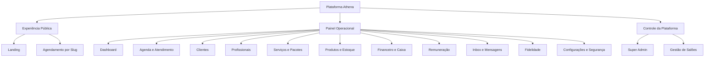
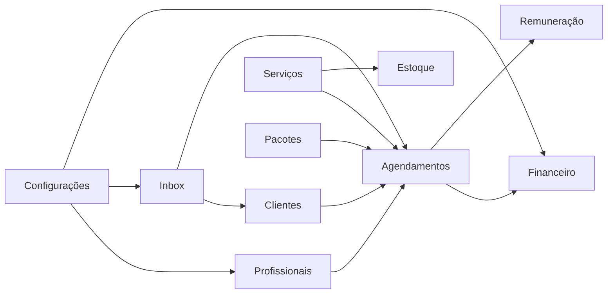

# Mapa de Módulos

## Visão Geral

O produto está organizado em módulos funcionais que combinam operação de salão, gestão administrativa e automação assistida.

## 1. Experiência Pública

### Landing

Função:

- aquisição e posicionamento comercial do produto

Responsabilidades:

- apresentação da proposta de valor
- planos, provas e CTA de entrada

### Agendamento por `slug`

Função:

- permitir descoberta pública do salão e criação de agendamentos

Responsabilidades:

- carregar branding e dados públicos do salão
- listar serviços, pacotes e profissionais
- exibir disponibilidade
- confirmar agendamento e disparar notificações

## 2. Agenda e Atendimento

Função:

- ser o centro operacional do dia a dia do salão

Responsabilidades:

- visualizar agenda por profissional e horário
- criar, editar, reagendar e cancelar atendimentos
- adicionar itens extras e produtos
- controlar status e pagamento
- registrar fotos, avaliação e observações

## 3. Clientes

Função:

- concentrar relacionamento e histórico operacional do cliente

Responsabilidades:

- cadastro e busca
- histórico de visitas
- comportamento de consumo
- base para fidelidade e campanhas

## 4. Profissionais

Função:

- gerenciar equipe, identidade operacional e escopo de atendimento

Responsabilidades:

- dados cadastrais
- categorias
- serviços atendidos
- horários
- metas, comissão e dados bancários

## 5. Serviços e Pacotes

Função:

- modelar o catálogo operacional do salão

Responsabilidades:

- serviços com duração e preço
- pacotes compostos
- vínculo com profissionais
- consumo de produtos por serviço

## 6. Produtos e Estoque

Função:

- controlar venda e consumo operacional

Responsabilidades:

- cadastro de produtos
- estoque disponível
- baixa em PDV e atendimento
- consumo automático por serviço

## 7. Financeiro e Caixa

Função:

- organizar caixa diário e visibilidade financeira operacional

Responsabilidades:

- abertura e fechamento de caixa
- sangria e suprimento
- sessões por turno
- fechamento diário
- despesas
- conferência por forma de pagamento

## 8. Remuneração

Função:

- suportar gestão de comissão e performance da equipe

Responsabilidades:

- comissões por atendimento
- status de pagamento
- metas e bônus
- visão por profissional e período

## 9. Inbox e Mensagens

Função:

- centralizar comunicação com clientes e operação assistida

Responsabilidades:

- histórico de conversas
- resposta manual
- integração com WhatsApp
- base para automações e atendimento com IA

## 10. Fidelidade e Relacionamento

Função:

- aumentar retenção e recorrência

Responsabilidades:

- cashback ou pontos
- campanhas
- lembretes
- relacionamento contínuo

## 11. Configurações, Segurança e Governança

Função:

- controlar o ambiente operacional do salão

Responsabilidades:

- branding e dados da unidade
- usuários e permissões
- auditoria
- senha e segurança
- backup exportável
- configuração de WhatsApp e IA

## 12. Super Admin

Função:

- operar a plataforma do ponto de vista do provedor

Responsabilidades:

- login separado
- gestão de salões
- impersonação
- métricas globais
- comunicação com a base

## Relação Entre Módulos

