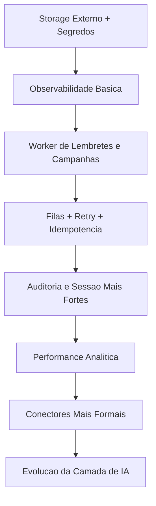

# Roadmap Técnico 6-12 Meses

## Objetivo

Este roadmap prioriza robustez operacional, capacidade de escala e previsibilidade de evolução, sem perder velocidade de produto.

## Horizonte de 0-3 Meses

### 1. Hardening de Produção

Entregas:

- storage externo para uploads
- revisão de secrets management
- rate limiting em login, reset e booking público
- ampliação de headers e postura de segurança web

Impacto:

- reduz risco operacional imediato
- melhora preparo para ambientes de produção mais agressivos

### 2. Observabilidade Básica

Entregas:

- logs estruturados
- métricas de erro por integração
- telemetria mínima para jobs e webhooks
- melhor separação entre falha de plataforma e falha de provedor

Impacto:

- aumenta capacidade de suporte
- acelera diagnóstico de incidentes

## Horizonte de 3-6 Meses

### 3. Worker e Filas

Entregas:

- worker dedicado para lembretes e campanhas
- fila para notificações externas
- retries e idempotência para mensageria
- desacoplamento parcial entre API síncrona e integrações

Impacto:

- melhora resiliência
- prepara a plataforma para mais volume de mensagens

### 4. Auditoria e Segurança Avançadas

Entregas:

- ampliar cobertura da auditoria
- centralizar eventos sensíveis
- política melhor de invalidação de sessão
- revisão de persistência de token no navegador

Impacto:

- fortalece governança
- melhora postura de segurança e compliance operacional

## Horizonte de 6-9 Meses

### 5. Analytics e Performance de Dados

Entregas:

- otimização de consultas analíticas
- índices orientados a tenant e período
- eventuais tabelas de agregação
- melhoria de dashboards executivos

Impacto:

- melhor experiência para gestores
- redução de custo computacional em relatórios

### 6. Camada Formal de Conectores

Entregas:

- contratos mais claros para integrações
- health status por conector
- configuração mais padronizada
- preparação para novos canais ou provedores

Impacto:

- reduz acoplamento
- acelera expansão de integrações

## Horizonte de 9-12 Meses

### 7. Evolução da Camada de IA

Entregas:

- melhor separação entre ferramentas, contexto e execução
- telemetria de uso da IA
- política de fallback por provedor
- preparação para novas automações assistidas

Impacto:

- torna a camada de IA mais previsível
- melhora governança de custo e confiabilidade

### 8. Preparação para Operação Multi-Serviço

Entregas:

- avaliar extração formal de worker service
- avaliar serviço dedicado para webhook/inbox se o volume justificar
- definir critérios claros para sair do monólito modular

Impacto:

- evita over-engineering cedo demais
- prepara transição segura se o crescimento pedir

## Sequência Priorizada

## O Que Não Vale Fazer Ainda

Neste estágio, eu evitaria antecipar:

- microserviços completos sem necessidade clara
- reescrita de frontend por moda arquitetural
- abstrações excessivamente genéricas de conectores
- plataformas de eventos complexas antes de haver volume real

## Leitura Executiva

Se a meta for crescimento comercial com segurança técnica, a melhor ordem é:

1. endurecer produção
2. separar o que é background
3. dar confiabilidade às integrações
4. só então sofisticar analytics e IA
