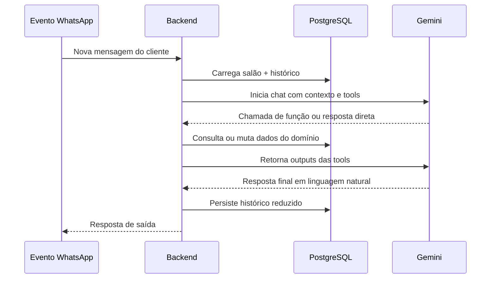
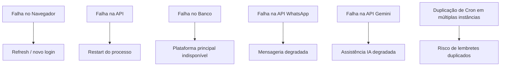

# Runtime

## Visão Geral

O runtime deste repositório é um runtime de aplicação em camadas, e não um executor genérico de agentes de longa duração. Ele é composto por:

- runtime de navegador para a SPA React
- runtime HTTP request/response em Express
- execução agendada em background via `node-cron`
- runtime conversacional orientado a mensagens para fluxos WhatsApp + IA

Onde o pedido original cita heartbeat, reconnect logic e browser orchestration, a documentação abaixo descreve os equivalentes realmente implementados e deixa explícito o que ainda não existe.

## Superfícies de Runtime

### 1. Runtime do Navegador

O navegador é o shell principal para:

- agendamento público
- operação administrativa
- operação super-admin

Comportamentos centrais:

- carregamento lazy de rotas com `React.lazy`
- persistência de token em `localStorage`
- injeção de token via interceptor Axios
- navegação guiada por permissões
- timers de expiração com logout automático
- navegação mobile e orquestração de modais

### 2. Runtime da API

O aplicativo Express é responsável por:

- parsing de requisições e política de CORS
- serving de uploads estáticos
- rotas públicas e autenticadas
- validações de domínio
- leituras e escritas no banco
- chamadas para integrações externas
- geração de trilha de auditoria em ações selecionadas

### 3. Runtime Agendado

A aplicação sobe o scheduler de lembretes no boot por meio de `iniciarLembretes()`. Isso cria um cron em processo.

Implicações atuais:

- trabalho agendado depende do ciclo de vida do processo da API
- escalonamento horizontal duplicaria execução do cron se não houver coordenação
- o modelo é simples de operar, mas ainda não está isolado em worker

### 4. Runtime Conversacional

O fluxo WhatsApp + Gemini é a parte mais próxima de um runtime de agente dentro do repositório.

Ele realiza:

- ingestão de mensagem
- resolução da configuração do salão
- recuperação de histórico conversacional
- chamada LLM com tools declaradas
- execução iterativa das tools
- síntese da resposta final
- persistência do histórico atualizado

## Equivalente ao Ciclo de Vida de Agente

Não há supervisor genérico de agentes. O ciclo implementado hoje é um ciclo por mensagem.

Etapas do ciclo:

1. resolver tenant e contexto do canal
2. reidratar histórico persistido
3. invocar Gemini com instruções e tools
4. executar até um número limitado de rodadas de tool calling
5. persistir histórico resultante
6. devolver ou enviar a resposta

## Sistema de Heartbeat

Um mecanismo dedicado de heartbeat não está implementado hoje.

O que existe no lugar:

- endpoint de saúde em `/health`
- timer de expiração de sessão no frontend
- histórico de conversa em banco, permitindo requests stateless

Melhorias futuras recomendadas:

- heartbeat para workers e consumidores de webhook
- telemetria de integrações além do simples status do WhatsApp

## Lógica de Reconexão

Não existe hoje um subsistema explícito de reconexão com websocket ou stream persistente.

Comportamento atual:

- o navegador depende do retry padrão de HTTP
- usuários podem recarregar a SPA e retomar a sessão enquanto o token estiver válido
- fluxos IA/WhatsApp se recuperam de restart porque o estado relevante está no PostgreSQL

Limitações:

- não há fila offline no frontend
- não há job orchestration durável para campanhas longas
- não há política uniforme de retry para todas as integrações externas

## Persistência de Sessão

### Sessões do Navegador

As sessões de admin e super-admin ficam em `localStorage`:

- `salao_token`
- `salao_token_expires_at`
- snapshot de permissões
- role e vínculo com profissional
- `sa_token` para super-admin

Isso oferece reentrada rápida e proteção de rota sem session store no servidor.

### Persistência de Domínio

A continuidade operacional depende do armazenamento em banco de:

- clientes
- agendamentos
- sessões de caixa
- trilhas de auditoria
- conversas e mensagens
- tokens de redefinição de senha

### Persistência Conversacional

O runtime WhatsApp/Gemini persiste o histórico em `Conversa.historico`, limitado a uma janela controlada. Isso permite:

- continuidade entre mensagens
- APIs stateless
- reaproveitamento de contexto em interações futuras

## Orquestração de Navegador

Este repositório não orquestra browsers externos nem automação headless. O navegador aqui cumpre o papel tradicional de cliente SPA.

A orquestração lado cliente inclui:

- transição de rotas
- filtragem de menu por permissão
- gerenciamento de menu mobile e modais
- acesso autenticado por token
- progressão do funil público de agendamento

## Gestão de Estado em Runtime

### Estado Cliente

A maior parte do estado do frontend é React state local, com persistência apenas para autenticação e sessão.

### Estado Servidor

O estado canônico do sistema vive no PostgreSQL e é acessado via Prisma.

### Estado de Integração

O estado das integrações fica dividido entre:

- configuração persistida em `Salao`
- estado externo controlado pelo provedor
- contexto transitório em memória durante uma request

## Recuperação de Falhas

### O Que Se Recupera Bem Hoje

- refresh do navegador após falhas transitórias
- restart da API, já que o estado crítico é persistido
- continuidade do histórico conversacional após reinício
- reentrada por token até a expiração

### O Que Ainda É Mais Frágil

- cron em processo quando há múltiplas instâncias
- storage local em hosts efêmeros
- retries de delivery para integrações externas
- workloads de campanha sem fila

## Modelo de Execução Local

Em desenvolvimento local, a execução é direta:

- backend em Node/Express
- frontend em Vite
- PostgreSQL acessado pelo Prisma
- uploads hospedados em filesystem local

Isso dá um ciclo de feedback curto, mas endurecimento de produção tende a beneficiar separação entre:

- API
- workers
- storage
- observabilidade

## Domínios de Falha

## Próxima Evolução Recomendada

- mover lembretes e campanhas para worker dedicado
- introduzir fila com retry para mensageria externa
- ampliar observabilidade de saúde de integrações
- separar ingestão de webhook de execução de saída
- adicionar idempotência em escritas e notificações sensíveis
