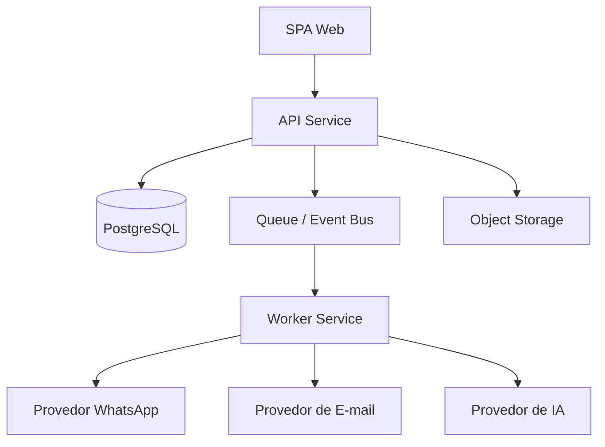
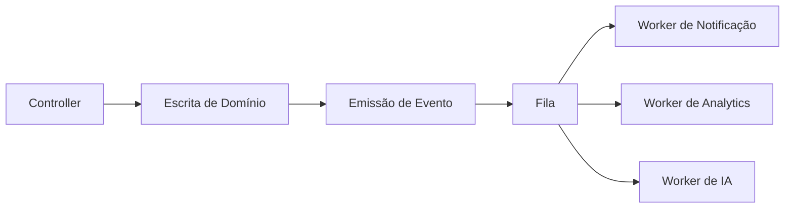

# Escalabilidade

## Visão Geral

A arquitetura atual é uma boa base para um vertical SaaS em estágio inicial: simples de operar, rápida para evoluir e clara do ponto de vista de domínio. Ela já nasce com uma raiz forte de multi-tenant e com fronteiras stateless na API, o que facilita crescimento controlado.

As limitações principais de escalabilidade não estão na stack web em si, mas em algumas decisões operacionais:

- jobs agendados em processo
- storage local de arquivos
- integrações externas síncronas
- concentração crescente de lógica em um backend monolítico

## Considerações Multi-Tenant

O sistema é estruturado em torno de `Salao`.

Pontos fortes:

- raiz de tenant clara no schema
- branding e integração configuráveis por tenant
- usuários, agenda, caixa, estoque e conversas segmentados por salão

Implicações de escala:

- o isolamento multi-tenant pode ser mantido em banco compartilhado
- quotas e rate limiting por tenant podem ser introduzidos gradualmente
- tenants muito grandes podem futuramente justificar particionamento operacional

## Escala do Runtime

### O Que Já Escala Bem

- entrega da SPA React
- requests autenticadas stateless
- CRUD e operação via Prisma/PostgreSQL para carga moderada
- autenticação JWT sem sticky session

### O Que Exige Atenção em Escala Horizontal

- lembretes em `node-cron` rodariam em todas as réplicas
- uploads locais não escalam entre instâncias
- integrações externas ainda não usam fila centralizada

## Possibilidades de Orquestração Distribuída

O código atual pode evoluir para execução distribuída sem reescrita completa.

Separação recomendada:

- `api-service` para tráfego web
- `worker-service` para lembretes, campanhas e tarefas pesadas
- `webhook-service` para ingestão, se o volume crescer
- `storage-service` baseado em object storage e não em disco local

## Escala dos Conectores

O crescimento dos conectores provavelmente seguirá três eixos:

### 1. Mais Volume

- mais lembretes
- mais campanhas
- mais conversas assistidas por IA

### 2. Mais Provedores

- novos canais de mensagem
- novos provedores de IA
- integrações com CRM, pagamento ou analytics

### 3. Mais Requisitos de Confiabilidade

- retries
- dead-letter handling
- observabilidade de entrega
- idempotência

## Possibilidades de Arquitetura com Filas/Eventos

O repositório ainda não usa fila, mas vários workloads já são candidatos naturais:

- disparo de lembretes
- campanhas
- IA proativa
- processamento de webhooks
- pós-processamento de imagens/anexos
- replicação de auditoria para analytics

Uma arquitetura futura poderia seguir este padrão:

## Escala do Banco de Dados

O modelo Prisma/PostgreSQL é adequado para o estágio atual, mas o crescimento vai exigir:

- índices orientados a tenant
- estratégia de arquivamento para histórico grande
- caminhos mais otimizados para relatórios
- revisão contínua de consultas com filtros amplos por data

Tabelas com maior tendência de crescimento:

- `Agendamento`
- `Mensagem`
- `Conversa`
- `AuditLog`

## Escala do Frontend

No frontend, o desafio de escala é mais organizacional do que infraestrutural.

À medida que o produto cresce, é provável que valha separar melhor:

- hooks de dados por domínio
- módulos de interface por contexto funcional
- primitives do design system
- gerenciamento de estado em telas muito densas

## Compatibilidade Futura com MCP

O sistema atual não é baseado em MCP, mas vários conceitos se conectam bem a uma futura camada compatível:

- tools sobre agenda, CRM e financeiro
- resources sobre dados do salão
- capability declarations sobre permissões
- connector profiles sobre WhatsApp, IA e e-mail

Isso significa que compatibilidade com MCP é plausível como camada adicional, e não como reescrita obrigatória.

## Trade-offs de Escala

### Benefícios da Arquitetura Atual

- baixa complexidade operacional
- alta velocidade de desenvolvimento
- bom isolamento por tenant
- poucos componentes para manter

### Custos da Arquitetura Atual

- background work acoplado ao ciclo da API
- resiliência limitada para comunicação externa em burst
- restrições de storage local
- controllers e rotas concentrados em um backend único

## Sequência Recomendada

1. mover uploads para object storage
2. extrair lembretes e campanhas para worker
3. introduzir fila para mensageria externa
4. ampliar observabilidade e rate limiting
5. separar webhook e fluxos pesados de IA se a escala realmente pedir
