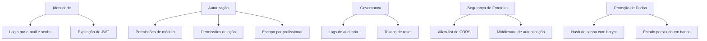

# Segurança

## Visão Geral

A plataforma já possui controles relevantes de segurança operacional:

- autenticação baseada em JWT
- isolamento por tenant
- autorização por módulo e por ação
- auditoria para ações sensíveis selecionadas
- validação de força de senha
- fluxo de recuperação de senha com token persistido

Ao mesmo tempo, a implementação atual ainda é a de um SaaS prático, e não de uma plataforma zero-trust. Este documento separa garantias atuais de oportunidades de endurecimento.

## Isolamento de Sessão

### Isolamento por Tenant

A principal fronteira de isolamento é `salaoId`.

A maior parte das entidades de domínio é modelada como pertencente a um `Salao`, incluindo:

- usuários
- profissionais
- serviços
- produtos
- agendamentos
- sessões de caixa
- conversas
- logs de auditoria

### Isolamento por Usuário

O isolamento entre usuários é reforçado por:

- identidade carregada no JWT
- permissões por role
- permissões de ação
- filtros por `profissionalId` para logins de profissional

## Tratamento de Credenciais

### Senhas

- senhas de usuários são hashadas com `bcryptjs`
- criação e reset exigem senha com complexidade mínima
- tokens de reset são gerados aleatoriamente e persistidos no banco

### JWTs

- emitidos em login e signup
- carregam tenant, role e snapshots de permissão efetiva
- expiram em 7 dias
- são armazenados no `localStorage`

Trade-off:

- simplicidade operacional e APIs stateless
- postura de segurança inferior à de `httpOnly` cookies em ambiente de navegador

### Credenciais de Terceiros

Credenciais de provedores ficam hoje no registro do `Salao`, por tenant, para integrações como:

- Evolution API
- Gemini API

Esse modelo dá flexibilidade operacional, mas exige proteção forte no banco e no painel administrativo.

## Estratégia de Persistência Local

As superfícies de persistência atuais são:

- PostgreSQL para estado principal de negócio
- filesystem local para uploads
- `localStorage` para sessão e snapshots de permissão

Implicações de segurança:

- uploads locais não devem ser tratados como object storage seguro e durável
- `localStorage` aumenta impacto potencial de XSS
- produção deve considerar secret storage mais robusto para chaves de integração

## Considerações de Segurança no Navegador

### Medidas Atuais

- allow-list de origem em CORS
- route guarding
- logout automático por expiração de token

### Riscos Atuais

- JWT em `localStorage` aumenta blast radius em caso de XSS
- não há CSP explícita visível nesta camada
- a postura de CSRF não está documentada porque a autenticação é header-based, não cookie-based

## Considerações sobre OAuth

OAuth não está implementado atualmente.

Se for incorporado para novos conectores ou canais, recomenda-se:

- cofre de tokens por tenant
- criptografia em repouso para refresh tokens
- escopo mínimo por conector
- rotação e revogação de tokens

## Segurança da Sincronização com Nuvem

A sincronização externa ocorre hoje principalmente por chamadas diretas para:

- Evolution WhatsApp API
- Gemini API
- provedor de e-mail

Recomendações operacionais:

- adicionar retries com idempotência
- evitar vazamento de segredos em logs
- separar health de integração de health da plataforma
- rastrear falhas de envio em storage durável ou fila

## Auditoria e Accountability

O subsistema de auditoria registra:

- nome da ação
- entidade e id da entidade
- ator
- status e severity
- contexto opcional
- IP de origem e user-agent

Isso já fornece uma boa base para:

- revisão forense
- governança de acesso
- accountability operacional

Limitação atual:

- apenas fluxos explicitamente instrumentados geram log de auditoria

## Modelo de Ameaças

### Ameaças Primárias

1. acesso indevido entre tenants
2. escalada de privilégio por ausência de check backend
3. roubo de token por XSS ou navegador comprometido
4. vazamento de credenciais de integrações
5. abuso de canais de mensageria
6. replay ou duplicação de ações operacionais
7. duplicação de cron em deploy multi-instância

### Ameaças Secundárias

1. exposição de uploads locais
2. baixa observabilidade sobre falhas de integração
3. ausência de rate limiting mais forte em auth e agendamento público

## Matriz de Controles

## Prioridades de Hardening

Próximos passos de maior valor:

- migrar auth do navegador para estratégia com `httpOnly` cookies, se o produto comportar
- adicionar rate limiting estruturado para login, reset de senha e booking público
- criptografar ou isolar melhor segredos de integração
- mover uploads para object storage gerenciado
- adicionar CSP e headers de segurança mais fortes
- ampliar cobertura de auditoria para todas as mutações sensíveis
- adicionar proteção de idempotência em mensageria e financeiro
